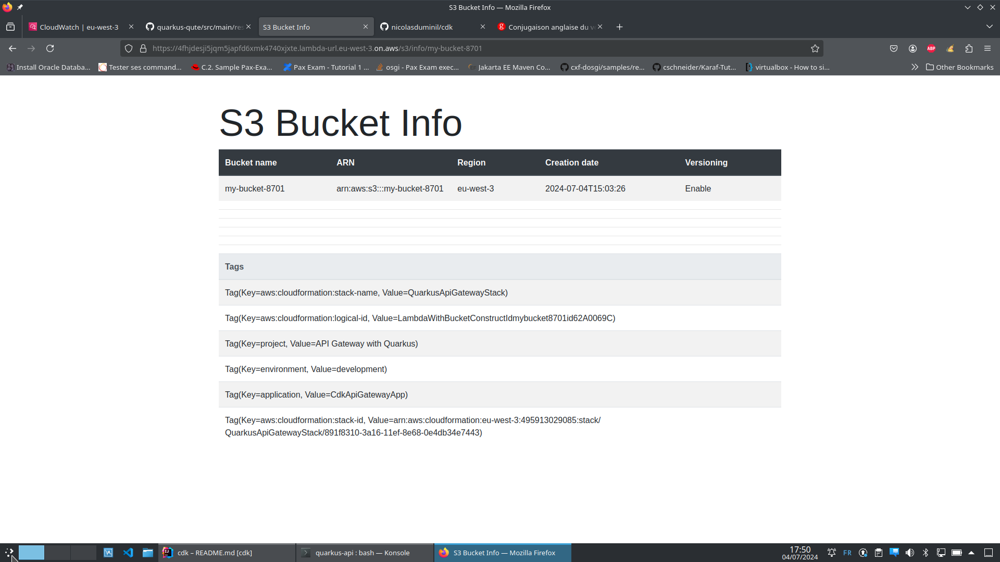

# AWS Infrastructure as Code with Quarkus

*Infrastructure as Code* (IaC), as the name implies, is a practice which consists in defining infrastructure elements 
with code. This is as opposed to doing it through a GUI (*Graphical User Interface*) like, for example, the AWS Console.
The idea is that, in order to be deterministic and repeatable, the cloud infrastructure must be captured in an abstract 
description, based on models expressed in programming languages, such that to allow the automation of the operations that,
otherwise, should be performed manually.

AWS makes available several IaC tools, as follows:
  - CloudFormation: A provisioning tool able to create and manage cloud resources, based on templates expressed in JSON or YAML notation
  - AWS Amplify: An open-source framework that provides developers with anything they need to deliver applications connecting AWS infrastructure elements, together with web and mobile components
  - AWS SAM (Serverless Application Model): A tool that facilitates the integration of AWS Lambda functions with services like API Gateway, REST API, AWS SNS/SMQ, DynamoDB, etc.
  - AWS SDK (Software Development Kit): An API that provides management support to all AWS services using programming languages like Java, Python, TypeScript, and others
  - AWS CDK (Cloud Development Kit): This is another API like the SDK but more furnished, allowing not only management of AWS services, but also to programmatically create, modify, and remove CloudFormation stacks, containing infrastructure elements. It supports many programming languages, including but not limited to Java, Python, TypeScript, etc.

Other IaC tools exist, like Pulumi and Terraform and, even if they aren't developed by AWS, they provide a very interesting 
multi-cloud support. Like AWS SDK and AWS CDK, Pulumi let you define cloud infrastructure using common programming languages
and, like CloudFormation, Terraform uses a dedicated declarative notation, called HCL (*Hashicorp Configuration Language*).

This post is the first part of a series that aims to examine CDK in-depth as a high-level object-oriented abstraction to 
define cloud infrastructure by leveraging the power of programming languages.

## Introduction to AWS CDK
In AWS's own definition, CDK is an open source software development framework that defines AWS cloud resources using common
programming languages. Here we'll be using Java.

It's interesting to observe from the beginning that, as opposed to other IaC tools, like CloudFormation or Terraform, the
CDK isn't defined as being just an infrastructure provisioning framework. As a matter of fact, in AWS meaning of the term,
the CDK is more than that: an extremely versatile IaC framework which unleashes the power of programming languages and compilers
to manage highly complex AWS cloud infrastructure with code that is, compared to HCL or any other JSON/YAML based notation, 
much more readable and extensible. As opposed to these other IaC tools, with the CDK one can loop, map, reference, write 
conditions, use helper functions, in a word, take full advantage of the programming languages power.

But the most important advantage of the CDK is that it is a *Domain Specific Language* (DSL), thanks to the extensive 
implementation of the builder design pattern, which allows the developer to easily interact with the AWS services without 
having to learn convoluted APIs and other cloud provisioning syntaxes. Additionally, it makes possible powerful management
and customizations of reusable components, security groups, certificates, load balancers, VPCs (*Virtual Private Cloud*) 
and others.

The CDK is based on the concept on `Construct` as its basic building block. This is a powerful notion  which allows to abstract
away details of common cloud infrastructure patterns. A construct corresponds to one or more synthesized resources, which 
could be a small CloudFormation stack containing just an S3 bucket, or a large one containing a set of EC2 machines with 
the associated AWS Sytem Manager parameter store configuration, security groups, certificates and load balancers. It may be
initialized and reused as many times as required.

The `Stack` is a logical group of `Construct` objetcs. It can be viewed as a chart of the components to be deployed. It 
produces a declarative CloudFormation template, or a Terraform configuration, or a Kubernetes manifest file.

Last but not least, the `App` is a CDK concept which corresponds to a tree of `Construct` objects. There is a root `App` 
which may contain one or more `Stack` objects, containing in turn one or more `Construct` objects, that themselves might 
encompass other `Construct` objects, etc. The figure below depicts this structure.

There are [here](https://github.com/nicolasduminil/cdk) several examples accompanying this post and illustrating it. They
go from the most simple ones, creating a basic infrastructure, to the most complex ones, dealing with multi-region database
clusters and bastion hosts.

## A CDK starter
Let's begin with a starter project and build a CDK application which creates a simple stack containing only a S3 bucket.
Installing the CDK is straightforward, as explained [here](https://docs.aws.amazon.com/cdk/v2/guide/getting_started.html).
Once the CDK installed and bootstrapped, according to the above document, you may use its scaffolding functions in order
to quickly create a project skeleton. Run the following command:

    $ cdk init app --language java

A bunch of text will be displayed while the CDK scaffolder generates your Maven project and, once finished, you may examine
its structure as shown below:

     $ tree -I target
     .
     ├── cdk.json
     ├── pom.xml
     ├── README.md
     └── src
     ├── main
     │ └── java
     │     └── com
     │         └── myorg
     │             ├── TestApp.java
     │             └── TestStack.java
     └── test
         └── java
             └── com
                   └── myorg
                           └── TestTest.java

    9 directories, 6 files

This is your project skeleton created by the CDK scaffold. As you can see, there are a couple of Java classes, as well as
a test one. They aren't very interesting and you can already remove them, together with the package `com.myorg` which 
won't probably fit your naming convention. But the real advantage of using the CDK scafoldding function is the generation
of the `pom.xml` and `cdk.json` files.

The 1st one drives your application build process and defines the required dependencies and plugins. Open it and you'll see:

        ...
        <dependency>
          <groupId>software.amazon.awscdk</groupId>
          <artifactId>aws-cdk-lib</artifactId>
        </dependency>
        ...
        <plugin>
          <groupId>org.codehaus.mojo</groupId>
          <artifactId>exec-maven-plugin</artifactId>
          <configuration>
            <mainClass>fr.simplex_software.aws.iac.cdk.starter.CdkStarterApp</mainClass>
          </configuration>
        </plugin>
        ...
In order to develop CDK application you need the `aws-cdk-lib` Maven artifact. This is the CDK library containing all 
the required resources. The `exec-maven-plugin` is also required in order to run your application, once builded and deployed.
If you look in the `cdk.json` file that the `cdk init` command has generated for you, you'll see this:

    ...
    "app": "mvn -e -q compile exec:java"
    ...

This is the command that the CDK will use in order to build your application.
Of course, you don't have to use the scaffolding function if you don't want to and, if you prefer to start from scratch,
you can provide your own `pom.xml` since, after all, as a developer, you must be used to it. However, when it comes to
the `cdk.json` file, you better should get it generated.

So fine, you just got your projevct skeleton, now you need to customize it such that to adapt it to your needs. Have a look
at the `cdk-starter` project in the code repository. As you can see, there are two Java classes, `CdkStarterApp` and 
`CdkStarterStack`. The 1st one creates a CDK application by instantiating the `software.amazon.awscdk.App` class which
abstarcts the most basic CDK concept: the application. It's a recommended practice to tag the application, once instatiated,
such that different automatic tools be able to manipulate it, according to different purposes. For example, we can imagine
an automatic tool that removes all the test applications and, to do that, it scans them looking for the tag 
`environment:development`. 

The goal of an application is to define at least one stack and this is what our application does by instatiating the 
`CdlStarterStack` class. This class is a stack as it extends the `software.amazon.awscdk.Stack` one. And that's in its
constructor that we'll be creating an S3 bucket, as shown by the code snipet below:

    Bucket bucket = Bucket.Builder.create(this, "my-bucket-id")
      .bucketName("my-bucket-" + System.getenv("CDK_DEFAULT_ACCOUNT"))
      .autoDeleteObjects(true).removalPolicy(RemovalPolicy.DESTROY).build();

Here we create an S3 bucket having the id of `my-bucket-id` and the name of `my-bucket` to which we'll append the current
user's default account ID. The reason is that the S3 buckets names must be unique worldwide.

As you can see, the class `software.amazon.awscdk.services.s3.Bucket`, used here to abstract the *Amazon Simple Storage 
Service*, implements the design pattern *builder* which allows to define, in a DSL-like manner, properties like the 
bucket name, the auto delete and the removal policy, etc.

So this is our first simple CDK application. The following line in the `CdkStarterApp` class:

    app.synth();

is absolutely essential because it produces ("synthesizes" in the CDK parlance) the associated AWS CloudFormation stack
template. Once "synthesized" it may be deployed and used. So here is how:

    $ https://github.com/nicolasduminil/cdk.git
    $ cd cdk/cdk-starter
    $ mvn clean package
    $ cdk deploy --requireApproval=never

A buch of text will be again displayed and, after a while, if everything is okay, you should see a confirmation of your
stack successful deployment. Now, in order to check that everything worked as expected, you can the list of your deployed 
stack as follows:

    $ aws cloudformation list-stacks --stack-status-filter CREATE_COMPLETE

It is critical to filter the output list of the existent stack by their current status, in this case `CREATE_COMPLETE`,
such that to avoid to retrieve dozens of irrelevant information. So, you should see something like:

    {
        "StackSummaries": [
            ...
            {
                "StackId": "arn:aws:cloudformation:eu-west-3:...:stack/CdkStarterStack/83ceb390-3232-11ef-960b-0aa19373e2a7",
                "StackName": "CdkStarterStack",
                "CreationTime": "2024-06-24T14:03:21.519000+00:00",
                "LastUpdatedTime": "2024-06-24T14:03:27.020000+00:00",
                "StackStatus": "CREATE_COMPLETE",
                "DriftInformation": {
                    "StackDriftStatus": "NOT_CHECKED"
                }
            }
            ...
        ]
    }

Now, you can get more detailed information about your specific stack:

    $ aws cloudformation describe-stacks --stack-name CdkStarterStack

the output will be very verbose and we'll not reproduce it here, but you should see intyeresting information like:

    ...
    "RoleARN": "arn:aws:iam::...:role/cdk-hnb659fds-cfn-exec-role-...-eu-west-3",
        "Tags": [
            {
                "Key": "environment",
                "Value": "development"
            },
            {
                "Key": "application",
                "Value": "CdkApiGatewayApp"
            },
            {
                "Key": "project",
                "Value": "API Gateway with Quarkus"
            }
        ],
    ...
 
And of course, you may check that you S3 bucket has been successfuly created:

    $ aws s3api list-buckets --query "Buckets[].Name"

Here, using the option `--query "Buckets[].Name` you filter the output such that only the bucket name be displayed and
you'll see:

    [
        ...
        "my-bucket-...",
        ...
    ]

and if you want to see some properties, for example the associated tags:

    $ aws s3api get-bucket-tagging --bucket my-bucket-...
        {
            "TagSet": [
                {
                    "Key": "aws:cloudformation:stack-name",
                    "Value": "CdkStarterStack"
                },
                {
                    "Key": "environment",
                    "Value": "development"
                },
                {
                    "Key": "application",
                    "Value": "CdkStarterApp"
                },
                {
                    "Key": "project",
                    "Value": "The CDK Starter projet"
                },
                {
                    "Key": "aws-cdk:auto-delete-objects",
                    "Value": "true"
                }
            ]
        }

Everything seems to be okay and you may conclude that your first test with the CDK is successful. And since you have deployed
now a stack with an S3 bucket, you are supposed to be able to use this bucket, for example to upload files in it, to download 
them, etc. You can do that by using AWS CLI, as shown [here](https://docs.aws.amazon.com/fr_fr/cli/latest/userguide/cli-services-s3-commands.html).
The following sections will demonstrate how to do it with the CDK.

## CDK applications with Quarkus

If you're a software developer and you weren't living on the planet Mars during these last years, then you certainly know 
what Quarkus is. And just in case you don't, you may find it out [here](https://quarkus.io/).

With Quarkus, the field of the enterprise cloud-native applications development has never been so confortable and it 
never took advantage of such a friendly and professional working environment. Internet abounds in posts and articles
explaining why and how Quarkus is a must for the enterprise, cloud-native software developer. And of course, CDK applications
aren't on the sidelines, on the opposite, they can greatly take advantage of the Quarkus features such that to become smaller, 
faster and more aligned with nowadays requirements.

Let's look at our first CDK with Quarkus example in the code repository. Go to the Maven module named `cdk-quarkus` and open
the file `pom.xml` to see how to combine specific CDK and Quarkus dependencies and plugins.

          ...
          <dependency>
            <groupId>io.quarkus.platform</groupId>
            <artifactId>quarkus-bom</artifactId>
            <version>${quarkus.platform.version}</version>
            <type>pom</type>
            <scope>import</scope>
          </dependency>
          <dependency>
            <groupId>io.quarkiverse.amazonservices</groupId>
            <artifactId>quarkus-amazon-services-bom</artifactId>
            <version>${quarkus-amazon-services.version}</version>
            <type>pom</type>
            <scope>import</scope>
          </dependency>
          ...

In addition to the `aws-cdk-lib` artifact which represents the CDK API library and is inherited from the parent Maven moduke,
the dependencies above are required in order to develop CDK Quarkus applications. The first one, `quarkus-bom`, is the 
*Bill of Material* (BOM) which includes all the other required Quarkus artifacts. Here we're using Quarkus 3.11 which is
the most recent release as per this writing. The 2nd one is the BOM of the Quarkus extensions required to interact with
AWS services.

Another mandatory requirement of Quarkus applications is the use of the `quarkus-maven-plugin` which is responsible to run 
the build and augmentation process. Let's recall that, as opposed to more traditional frameworks, like Spring or Jakarta EE,
where the application's initialization and configuration steps happen at the runtime, Quarkus performs them at buildtime, in
a specific phase called "augmentation". Consequently, Quarkus doesn't rely on the Java introspection and reflection, which is
one of the reason it is much faster than Spring, but needs to use the `jandex-maven-plugin` to build an index helping to 
discover annotated classes and beans in exernal modules.

This is almost all as far as the Quarkus master POM is concerned. Let's look now at the CDK submodule. But first, we need
to recall that, in order to synthzize and deploy a CDK application, we need a specific working encironment defined by the
`cdk.out` file. Hence, trying to use CDK commands in a project not having at its root this file wull fail.

One of the essential function that the `cdk.out` file aims at is to define how to run the CDK application. By default, the
`cdk init app --language java` command, used to scaffold the project's skeleton, will generate the following JSON statement:

    ...
    "app": "mvn -e -q compile exec:java"
    ...

This means that whenever we will run a `cdk deploy ...` command, such that to synthetize a CloudFormation stack and to 
deploy it, the `maven-exec-plugin` will be used to compile and package the code, before starting the associated main Java class.
This is the most general case, the one of a classical Java CDK application. But to run a Quarkus application, we need to
observe some special conditions. Quarkus packages an application as either a *fast* or a *thin* JAR and, if you aren't
familiar with these terms, please don't hesitate to consult the documentation which explains them in details. What interests
us here is the fact that, by default, a *fast* JAR will be generated, under the name of `quarkus-run.jar` in the 
`target/quarkus-app` directory. Unless we're using Quarkus extensions for AWS, inwhich case a *thin* JAR is generated, in
`target/$finalName-runner.jar` file, where `$finalName` is the value of the same element in `pom.xml`.

In our case, we're using Quarkus extensions for AWS and, hence, a *thin* JAR will be created by the Maven build process.
And in order to run a Quarkus *thin* JAR; we need to manually modify the `cdk.json` file such that to replace the line above by the following one:

    ...
    "app": "java -jar target/quarkus-app/quarkus-run.jar"
    ...

The other important point to notice here is that, in general, a Quarkus application is one exposing a REST API which
endpoint is started by the command above. But in our case, the one of a CDK application, there isn't any REST API and, 
hence, this endpoint needs to be specified in a different way. Look at our main class in the `cdk-quarkus-api-gateway` 
module.

    @QuarkusMain
    public class CdkApiGatewayMain
    {
      public static void main(String... args)
      {
        Quarkus.run(CdkApiGatewayApp.class, args);
      }
    }

Here, the `@QuarkusMain` annotation flags the subsequent class as the appliation's main endpoint and, further, using the
`io.quarkus.runtime.Quarkus.run()` method will execute the mentioned class until it either receives a signal like `Ctrl-C`,
or one of the exit methods of the same API is called.

So, we just saw how the CDK Quarkus application is started and that, once started, it runs the `CdkApiGAtewayApp` until 
it exits. This class is our CDK one which implements the `App` and that we've already seen in the previous post. But this 
time it looks differently, as you may see:

    @ApplicationScoped
    public class CdkApiGatewayApp implements QuarkusApplication
    {
      private CdkApiGatewayStack cdkApiGatewayStack;
      private App app;

      @Inject
      public CdkApiGatewayApp (App app, CdkApiGatewayStack cdkApiGatewayStack)
      {
        this.app = app;
        this.cdkApiGatewayStack = cdkApiGatewayStack;
      }

      @Override
      public int run(String... args) throws Exception
      {
        Tags.of(app).add("project", "API Gateway with Quarkus");
        Tags.of(app).add("environment", "development");
        Tags.of(app).add("application", "CdkApiGatewayApp");
        cdkApiGatewayStack.initStack();
        app.synth();
        return 0;
      }
    }

The first thing to notice is that, this time, we're using the CDI (*Context and Dependency Injection*) implemented by 
Quarkus, also called ArC, which is a subset of the Jakarta CDI 4.1 specifications. It also has another particularity: it's
a buildtime CDI, as opposed to the runtime Jakarta EE one. The difference lays in the augmentation process, as explained
previously.

Another important point to observe is that the class implements the `io.quarkus.runtime.QuarkusApplication` interface 
which allows it to customize and perform specific actions in the context bootstrapped by the `CdkApiGatewayMain` class.
As a matter of fact, it isn't recommended to perform such operations directly in the `CdkApiGatewayMain` since, at that 
point, Quarkus isn't completely bootstrapped and started yet.

We need to define our class as `@ApplicationScoped`, such that to be instantiated only once. We also used constructor 
injection and took adavantage of the *producer* pattern, as you may see in the `CdkApiGatewayProducer` class. We override
the `io.quarkus.runtime.QuarkusApplication.run()` method such that to customize our `App` object bytagging it, as we 
already did in the previous example, and to invoke `CdkApiGatewayStack`, responsible to instatiate and initialize our 
`CloudFormation` stack. Last but not least, the `app.synth()` statement is synthetizing this stack and, once executed,
our infrastructure, as defined by the `CdkApiGatewayStack`, should be deployed on the AWS cloud.

Here is now the CdkApiGatewayStack class:

    @Singleton
    public class CdkApiGatewayStack extends Stack
    {
      @Inject
      LambdaWithBucketConstructConfig config;
      @ConfigProperty(name = "cdk.lambda-with-bucket-construct-id", defaultValue = "LambdaWithBucketConstructId")
      String lambdaWithBucketConstructId;

      @Inject
      public CdkApiGatewayStack(final App scope, 
        final @ConfigProperty(name = "cdk.stack-id", defaultValue = "QuarkusApiGatewayStack") String stackId,
        final StackProps props)
      {
        super(scope, stackId, props);
      }

      public void initStack()
      {
        String functionUrl = new LambdaWithBucketConstruct(this, lambdaWithBucketConstructId, config).getFunctionUrl();
        CfnOutput.Builder.create(this, "FunctionURLOutput").value(functionUrl).build();
      }
    }

This class has chaged as well, compared to its previously release. It's a singleton which uses the concept of *construct*,
that was introduced formerly. As a matter of fact, instead of defining the stack structure here, in this class, as we did 
before, we do it by encapsulating the stack's elements, together with their configuration, in a *construct* which facilitates
to easily assemble cloud applications. In our project, this *construct* is a part of separate module, named 
`cdk-simple-construct`, such that we could reuse it repeatedly and to increase the application's modularity.

    public class LambdaWithBucketConstruct extends Construct
    {
      private FunctionUrl functionUrl;

      public LambdaWithBucketConstruct(final Construct scope, final String id, LambdaWithBucketConstructConfig config)
      {
        super(scope, id);
        Role role = Role.Builder.create(this, config.functionProps().id() + "-role")
          .assumedBy(new ServicePrincipal("lambda.amazonaws.com")).build();
        role.addManagedPolicy(ManagedPolicy.fromAwsManagedPolicyName("AmazonS3FullAccess"));
        role.addManagedPolicy(ManagedPolicy.fromAwsManagedPolicyName("CloudWatchFullAccess"));
        IFunction function = Function.Builder.create(this, config.functionProps().id())
          .runtime(Runtime.JAVA_21)
          .role(role)
          .handler(config.functionProps().handler())
          .memorySize(config.functionProps().ram())
          .timeout(Duration.seconds(config.functionProps().timeout()))
          .functionName(config.functionProps().function())
          .code(Code.fromAsset((String) this.getNode().tryGetContext("zip")))
          .build();
        functionUrl = function.addFunctionUrl(FunctionUrlOptions.builder().authType(FunctionUrlAuthType.NONE).build());
        new Bucket(this, config.bucketProps().bucketId(), BucketProps.builder().bucketName(config.bucketProps().bucketName()).build());
      }

      public String getFunctionUrl()
      {
        return functionUrl.getUrl();
      }
    }

This is our construct which encapsulates our stack elements: a Lambda function with its associated IAM role and an S3 bucket.
As you can see, it extends the `software.construct.Construct` class and its constructor, in addition to the standard `scope`
and `id` parameters, takes a configuration object named `LambdaWithBucketConstructConfig` which defines, among others, properties
related to Lambda function and the S3 bucket belonging to the stack.

Please notice that the Lambda function needs the IAM managed policy `AmazonS3FullAccess` in order to read, write, delete, etc.
to/from the associated S3 bucket. And since, for tracing purposes, we need to log messages to the CloudWatch service, the IAM
managed policy `CloudWatchFullAccess` is required as well. These two policies are associated to a role which naming convention
consists of append the suffix `-role` to the Lambda function name. Once this role created, it will be attached to the Lambda 
function. 

As for the Lambda function body, please notice how this is created from an asset dynamically extracted from the deployment
context. We'll come back in a few moments with more details concerning this point.

Last but not least, please notice how, after the Lambda function is created, an URL is attached to it and cached such that 
to be retrieved by the consumer. This way we completely decouple the infrastructure logic, i.e. the Lambda function itself, 
from the business logic, i.e. the Java code executed by the Lambda function, in our case a REST API implemented as a Quarkus
JAX-RS (RESTeasy) endpoint, acting as a proxy for the API Gateway exposed by AWS.

Comming back to the `CdkApiGatewayStack` class, we can see how, on the behalf of the Quarkus CDI implementation, we inject
the configuration object `LambdaWithBucketConstructConfig` declared externally, as well as how we use the Eclipse MicroProfile
Configuration to define its ID. Once the `LambdaWithBucketConstruct` instantiated, the only thing left to do is to display the
Lambda function URL, such that we can call it with different consumers, be them JUnit integration tests, `curl` utility or 
`postman`. 

We just have seen the whole mechanics which allows us to decouple the two fundamental CDK  building blocks `App` and 
`Stack`. We also have seen how to abstarct the `Stack` building block by making it an external module which, once compiled
and built as a standlone artifact, can simply be injected wherever needed. And also that the code executed by the Lambda function
in our stack can be plugged-in as well by providing it as an asset, in the form of a ZIP file, for example, and stored in the
CDK deployment context. This code is, it too, an external module named `quarkus-api` and consists in a REST API having a couple
of endpoints allowing to get some information, like the host IP address or the S3 bucket's associated attributes.

It's interesting to notice how Quarkus takes adavantage of the Qute templates to render HTML pages. For example, the following
endpoint displays the attributes of the S3 bucket that has been created as a part of the stack.

      ...
      @Inject
      Template s3Info;
      @Inject
      S3Client s3;
      ...
      @GET
      @Path("info/{bucketName}")
      @Produces(MediaType.TEXT_HTML)
      public TemplateInstance getBucketInfo(@PathParam("bucketName") String bucketName)
      {
        Bucket bucket = s3.listBuckets().buckets().stream().filter(b -> b.name().equals(bucketName)).findFirst().orElseThrow();
        TemplateInstance templateInstance = s3Info.data("bucketName", bucketName, "awsRegionName",
          s3.getBucketLocation(GetBucketLocationRequest.builder().bucket(bucketName).build()).locationConstraintAsString(),
          "arn",  String.format(S3_FMT, bucketName), "creationDate",
          LocalDateTime.ofInstant(bucket.creationDate(), ZoneId.systemDefault()), "versioning",
          s3.getBucketVersioning(GetBucketVersioningRequest.builder().bucket(bucketName).build()));
        return templateInstance.data("tags",
          s3.getBucketTagging(GetBucketTaggingRequest.builder().bucket(bucketName).build()).tagSet());
      }

This endpoint returns a `TemplateInstance` which structure is defined in the file `src/main/resources/templates/s3info.html`
and which is filled with data retrived by interogating the S3 bucket in our stack, on the behalf of the `S3Client` class
provided by the AWS SDK.

A couple of integration tests are provided and they take advantage of the Quarkus integration with AWS, thanks to which
it is possible to run locally cloud services, on the bhalf of `testcontainers` and `localstack`. In order to run them
proceed as follows:

    $ git clone https://github.com/nicolasduminil/cdk
    $ cd cdk/cdk-quarkus/quarkus-api
    $ mvn verify

Running the sequence of commands above will produce a quite verbose output and, at the end, you'll see something like:

    [INFO] 
    [INFO] Results:
    [INFO]
    [INFO] Tests run: 3, Failures: 0, Errors: 0, Skipped: 0
    [INFO]
    [INFO]
    [INFO] --- failsafe:3.2.5:verify (default) @ quarkus-api ---
    [INFO] ------------------------------------------------------------------------
    [INFO] BUILD SUCCESS
    [INFO] ------------------------------------------------------------------------
    [INFO] Total time:  22.344 s
    [INFO] Finished at: 2024-07-04T17:18:47+02:00
    [INFO] ------------------------------------------------------------------------

That's not big deal, just a couple of integration tests executed against a `localstack` running in `testcontainers` to
make sure that everything works as expected. But if you want to test against real AWS services, meaning that you fulfil
the requirements, than you should proceed as follows:

    $ git clone https://github.com/nicolasduminil/cdk
    $ cd cdk
    $ ./deploy.sh cdk-quarkus/cdk-quarkus-api-gateway cdk-quarkus/quarkus-api/

Running the script `deploy.sh` with the parameters shown above will synthtize and deploy your stack. These two parameters are:
  1. The CDK application module name. This is the name of the Maven module where your `cdk.json` file is.
  2. The REST API module name. This is the name of the Maven module where the `function.zip` file is.

If you look in the `deploy.sh` file, you'll see that:

    ...cdk deploy --all --context zip=~/cdk/$API_MODULE_NAME/target/function.zip...

This command deploys the CDK app after having set in the `zip` context variable the `function.zip` location. Do you remember
that the Lambda function has been created in the stack (`LambdaWithBucketConstruct` class) like this ?

    IFunction function = Function.Builder.create(this, config.functionProps().id())
    ...
    .code(Code.fromAsset((String) this.getNode().tryGetContext("zip")))
    .build();

The statement bellow gets the asset stored in the deployment context under the context variable `zip` and uses it as the
code that will be executed by the Lambda function.

The output of the `deploy.sh` file execution, quite verbose as well, will finish by displaying the Lambda function URL:

    ...
    Outputs:
    QuarkusApiGatewayStack.FunctionURLOutput = https://4fhjdesji5jqm5japfd6xmk4740xjxte.lambda-url.eu-west-3.on.aws/
    Stack ARN:
    arn:aws:cloudformation:eu-west-3:...:stack/QuarkusApiGatewayStack/891f8310-3a16-11ef-8e68-0e4db34e7443
    ...

Now, in order to test your stack, you may fire your prefered browser at 
https://4fhjdesji5jqm5japfd6xmk4740xjxte.lambda-url.eu-west-3.on.aws/s3/info/my-bucket-8701 and should see something 
looking like that:

Your test is successful and you know now how to use CDK constructs to create infrastructure standalone modules and to 
assemble them into AWS CloudFormation stacks. But there is more, so stay tuned !

## Managing infrastructure with Quarkus

At the end of the 1st Part of this CDK post collection, we promissed to demonstrate how to programatically manage the S3
bucket created as an elememnt of our stack. We did it using AWS CLI, let's see now how to do it in Java. The project 
`cdk-quarkus-s3`, in the same GIT repository, will be used to illustrate, on the purpose, a couple of advanced Quarkus
to AWS integration features, together with several tricks specific to RESTeasy which is, as everyone knows, the RedHat 
implementation of Jakarta REST specifications.

Let's start by looking in the project's `pom.xml` file which drives the Maven build process. You'll see the following
dependency:

      ...
      <dependency>
        <groupId>io.quarkiverse.amazonservices</groupId>
        <artifactId>quarkus-amazon-s3</artifactId>
      </dependency>
      <dependency>
        <groupId>io.quarkus</groupId>
        <artifactId>quarkus-amazon-lambda-http</artifactId>
      </dependency>
      <dependency>
        <groupId>io.quarkus</groupId>
        <artifactId>quarkus-rest-jackson</artifactId>
      </dependency>
      <dependency>
        <groupId>io.quarkus</groupId>
        <artifactId>quarkus-rest-client</artifactId>
      </dependency>
      ...
      <dependency>
        <groupId>software.amazon.awssdk</groupId>
        <artifactId>netty-nio-client</artifactId>
      </dependency>
      <dependency>
        <groupId>software.amazon.awssdk</groupId>
        <artifactId>url-connection-client</artifactId>
      </dependency>
      ...

The first dependency in the listing above, `quarkus-amazon-s3` is a Quarkus extension allowing to 